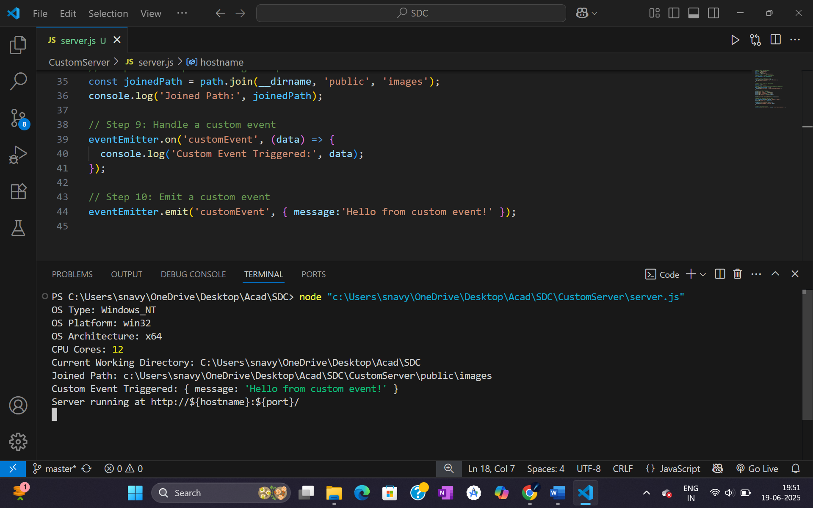

A Node.js HTTP server demonstrating core modules and event handling capabilities.

#Features#
HTTP Server: Simple web server serving "Hello, World!" response
System Information: Displays OS type, platform, architecture, and CPU cores
Path Management: Demonstrates path joining and current directory detection
Event Handling: Custom EventEmitter implementation with event triggers

#Core Modules Used#
http - HTTP server creation
os - Operating system information
path - File path manipulation
events - Event emitter functionality

#Usage#
Install Node.js
Run: node [CustomServer/server.js](CustomServer/server.js)
Access: http://127.0.0.1:3000
View console output for system information and events