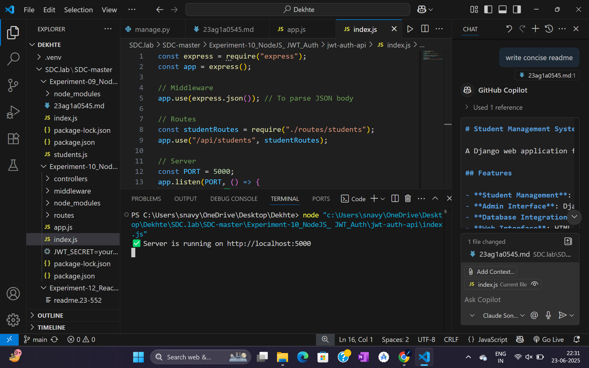

some glitch with GET

# JWT Authentication - Node.js

A Node.js authentication system using JSON Web Tokens (JWT) for secure user login and authorization.

## Features

- **User Registration**: Create new user accounts
- **User Login**: Authenticate users with credentials
- **JWT Tokens**: Secure token-based authentication
- **Protected Routes**: Middleware for route protection
- **Password Hashing**: Secure password storage with bcrypt
- **Token Validation**: Verify and decode JWT tokens

## Tech Stack

- **Node.js**: Runtime environment
- **Express.js**: Web framework
- **JWT**: JSON Web Tokens for authentication
- **bcrypt**: Password hashing
- **MongoDB/MySQL**: Database for user storage

## Quick Start

1. **Install dependencies**
   ```bash
   npm install
   ```

2. **Set environment variables**
   ```bash
   # Create .env file
   JWT_SECRET=your_secret_key
   DB_CONNECTION=your_database_url
   ```

3. **Start server**
   ```bash
   npm start
   ```

4. **Server runs on** `http://localhost:3000`

## API Endpoints

| Method | Endpoint | Description |
|--------|----------|-------------|
| POST | `/api/register` | Register new user |
| POST | `/api/login` | User login |
| GET | `/api/profile` | Get user profile (protected) |
| POST | `/api/logout` | User logout |

## Example Usage

### Register User
```bash
POST /api/register
Content-Type: application/json

{
  "username": "john_doe",
  "email": "john@example.com",
  "password": "password123"
}
```

### Login User
```bash
POST /api/login
Content-Type: application/json

{
  "email": "john@example.com",
  "password": "password123"
}
```

## Dependencies

- **express**: Web framework
- **jsonwebtoken**: JWT implementation
- **bcryptjs**: Password hashing
- **mongoose/mysql2**: Database connection

---
*Experiment 10: Node.js JWT Authentication - SDC Lab*